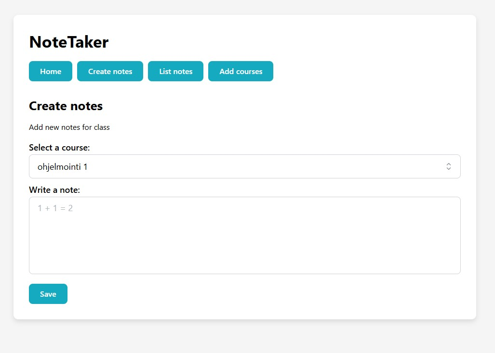

# NoteTaker

## Projektista
Ohjelma on frontend-kurssille tehty React-pohjainen luentomuistiinpanojen hallintasovellus, joka on toteutettu annetun dokumentoinnin pohjalta. 
Sovelluksessa voi tallentaa paikallisesti omia kursseja ja muistiinpanoja ja noutaa REST API:sta valmiita kursseja ja muistiinpanoja.

## Teknologiat
- React.js
- Mantine-komponenttikirjasto
- Zustand-tilanhallintakirjasto
- React-router: näkymien välinen reititys

## Asennus ja käyttöönotto
- lataa zip-tiedosto ja pura se

Suorita projektihakemistossa:
- npm install
- npm run dev

## Tekoälyn käytöstä
Hyödynsin Chat GPT:tä lähinnä debuggaukseen ja etsimään vian lähdettä kirjoittamastani rungosta seuraavissa ongelmatilanteissa:

**- Pyysin selittämään Zustandin mallistoren syntaksin**

**- Miksei NoteCreatorissa syötteen teksti ilmesty näkyviin?**
- UseState-hook puuttui noteText-muuttujasta, lisäsin sen
- "note.text" johon syötteen teksti tulee, oli väärässä kohdassa (suoraan elementissä), joten siirsin sen elementin sisään
- addNote oli käytetty väärin inputin onChange-käsittelijässä ja se lisäsi uusia muistiinpanoja aina, kun syötettä muutettiin. Vaihdoin sen tilalle setNoteText 

**- Fetchaaminen Zustandiin API:sta, selitä syntaksi ja selvitä miksei mitään ilmesty näkyviin**
- mappauksesta puuttui "return" sana
- fetchin kutsu puuttui komponentista joten listaus ei voinut päivittyä API:n datalla, lisäsin fetch-toiminnon App-komponenttiin

**- Miksi uutta kurssia lisätessä pudotusvalikkoon tulee vain tyhjä kohta, ei tekstiä?**
- id ja name kenttiä ei oltu lisätty oikein, ne piti lisätä objektina jossa on 'id' ja 'name' kentät, joten loin oikean muotoisen objektin CourseCreatoriin ja päivitin useCourseStoren syntaksin

**- Miksi API:n kautta fetchatut muistiinpanot näkyvät oikein mutta oman muistiinpanon lisäys kaataa ohjelman?**
- lisättävän Noteobjectin rakenne oli väärin ja ei vastannut APIn palauttaman datan rakennetta. Note.course.name kenttää ei löytynyt NoteItemistä koska olin tehnyt manuaalisia määrityksiä useNoteStoressa addNote-kohtaan. Poistin määritykset ja kirjoitin määritteiden tilalle pelkästään NoteObject

**- Miksi deleteNote poistaa kaikki muistiinpanot eikä vain yhtä?**
- deleteNote-metodi tallensi uuden tilan väärin ja koko vanha lista korvautui virheellisesti tyhjällä listalla
- aiemmin kutsuin deleteNotea koko listalla enkä vain poistettavalla muistiinpanolla joten vaihdoin siihen yksittäisen poistettavaksi halutun muistiinpanon

**- Miksi SelectCourseMenun callback ei lähetä dataa NoteCreatorille vaan valittu kurssi on aina "undefined"?**
- ongelma syntyi vain siitä että id oli numero ja select-elementin value oli string joten vertailuoperaatio jossa etsittiin oikeaa kurssia ei toiminut
- lisäsin course.id.toString() määritteen

**- Miksi create notes -näkymän select-valinta filteröi etäältä muistiinpanojen listausnäkymää vaikka ei pitäisi?**
- lisäsin Notelist-näkymässä propsina SelectCourseMenuun enableFiltering={true} ja selectCourseMenun handleChangeen ehdoksi, että jos enablefiltering on true, aktivoi filter

**- Kun siirtyy listausnäkymään ja suodatusvalintaa ei ole vielä klikattu, tulee näkyviin "no notes!". Ne saa näkyviin jos fetchaa API:sta datan filteredNotes-tilaan mutta silloin uudet muistiinpanot eivät näy.**
- NoteStoren addNotessa: lisäsin updatedNotes-muuttujan ja asetin sen filteredNotesin arvoksi jotta myös suodatetut muistiinpanot päivittyy uudella merkinnällä
- fetchNotes päivittää nyt filteredNotes:in API-datalla vain, jos se on tyhjä eli suodatus ei ole käynnissä (ei ole ehkä paras ratkaisu)

## Tulevia parannuksia
- Kun "List Notes" -näkymässä otetaan suodatus käyttöön, vaihdetaan toiseen näkymään ja palataan takaisin, suodatetut kurssit näkyvät oikein, mutta select-komponentti näyttää väärän tekstin, koska se ei muista valittua tilaa.
